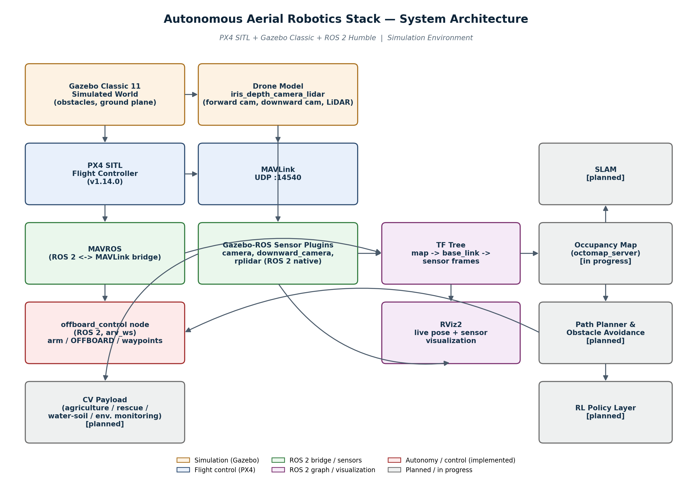

# Autonomous Aerial Robotics — PX4 + ROS 2 + Gazebo

### PX4 SITL,  ROS 2 Humble,  MAVROS, Gazebo Classic, OpenCV, LiDAR, RGB-D Vision, Unity3D

**Author:** Md. Rafiqul Islam | Bangladesh University of Textiles (BUTEX)  
**Period:** August 2026 – Present

# Overview

An autonomous quadrotor stack built on **PX4 SITL**, **Gazebo Classic 11**, **MAVROS**, and **ROS 2 Humble**, with a custom multi-sensor drone (forward depth camera, downward-facing camera, 2D LiDAR) and a ROS 2 offboard control node for autonomous flight. The project is extending into obstacle-aware navigation, SLAM, reinforcement learning, and a computer-vision payload for real-world applications such as precision agriculture, search & rescue, and environmental monitoring.



## Why this project

This started as a transition from ground/manipulator robotics (a UR5e digital-twin project and a SLAM/Nav2/RL-based car robot) into aerial robotics — applying the same ROS 2 / Gazebo / sensor-fusion foundations to a fundamentally different control problem: full 3D flight with underactuated dynamics, offboard mode arbitration, and airborne sensing.

## Status

| Phase | Description | Status |
|---|---|---|
| 0 | Environment setup (PX4 v1.14.0 built from source, Gazebo Classic SITL) | ✅ Complete |
| 1 | Offboard control — MAVROS bridge, arm/mode state-machine, autonomous waypoint missions | ✅ Complete |
| 2 | Sensors — custom multi-sensor drone model (forward depth camera, downward camera, LiDAR, IMU), full TF tree, RViz visualization | ✅ Complete |
| 3 | Mapping & obstacle awareness — custom obstacle world, occupancy mapping (octomap), SLAM | 🔶 In progress |
| 4 | Path planning & obstacle avoidance | ⬜ Planned |
| 5 | Reinforcement learning layer | ⬜ Planned |
| 6 | Unity digital twin | ⬜ Planned |
| 7 | Multi UAV Extension | ⬜ Planned |
| 8 | Computer vision payload (agriculture / rescue / water & soil sensing / environmental monitoring) | ⬜ Planned |

## Technical highlights

- **Custom Gazebo drone model** (`iris_depth_camera_lidar`) combining a forward depth camera, a nadir-pointed downward depth camera, and a 2D LiDAR — none of which existed as a pre-built PX4 SITL model, so the model, its ROS 2 sensor plugins, and its PX4 airframe/build-target registration were all built by hand.
- **Robust offboard control node**: rather than trusting single-shot MAVROS service responses (which are unreliable under simulation timing jitter), the control node treats `/mavros/state` as ground truth and drives arming/mode-switching with cooldown-based retries — eliminating race conditions between commanded and actual drone state.
- **Autonomous waypoint missions**: closed-loop waypoint sequencing using live local-position feedback and a distance/hold-based advance condition, rather than open-loop timed flight.
- **Full sensor TF tree**: `map → base_link → {camera_link, downward_camera_link, rplidar_link}`, enabling correct multi-sensor fusion and RViz visualization of pose, point clouds, and laser scans together.
- **Reproducible simulation environment**: a custom obstacle world with locally-cached assets (to remove dependency on Gazebo's online model database, which is unreliable on constrained connections).


## Architecture

See the diagram above. In short: Gazebo simulates the world and drone sensors → PX4 handles flight control over the simulated airframe → MAVROS bridges PX4's MAVLink stream into ROS 2 → sensor data and a full TF tree flow into RViz for visualization and (in progress) into an occupancy-mapping / SLAM / planning stack → a ROS 2 offboard control node closes the loop back to PX4 for autonomous flight.

## Repository structure

```
arv_ws/
├── src/
│   └── offboard_control/       # ROS 2 package: arm/mode state machine, waypoint missions
├── PX4-Autopilot/               # PX4 v1.14.0 source, with:
│   ├── Tools/simulation/gazebo-classic/sitl_gazebo-classic/models/
│   │   ├── iris_depth_camera_lidar/   # custom multi-sensor drone model
│   │   └── downward_camera/           # custom nadir camera model
│   └── ROMFS/px4fmu_common/init.d-posix/airframes/
│       └── 10020_gazebo-classic_iris_depth_camera_lidar


## Tech Stack

- PX4
- ROS 2 Humble
- MAVROS
- Gazebo Classic
- RViz
- Python
- C++
- OpenCV
- LiDAR
- RGB-D Vision
- Unity3D (planned)
